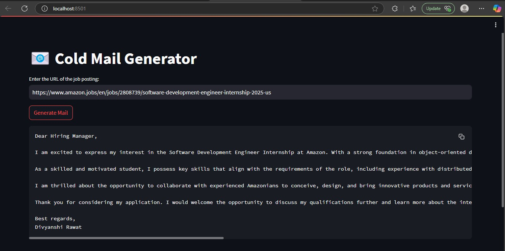

# Cold-Mail-Generator

This project is a cold email generation tool that leverages the power of LLaMA 3.3, a language model, to generate personalized cold emails based on job postings and skills. The system uses the provided job posting link and matches it with portfolio and skills (stored in a CSV file) to create a professional cold email.

 The API key provided via Groq is used to access the LLaMA 3.3 model for the generation.

## Features
### Job Posting Integration:
The tool takes a link to a job posting and generates a customized cold email.
### Skills & Portfolio Matching:
It uses a CSV file containing skills and portfolio to personalize the email content.
### LLaMA 3.3 Model:
The cold emails are generated using the LLaMA 3.3 model to ensure the content is relevant, well-written, and professional.

## Sample Output


### Generated sample cold mail
" Dear Hiring Manager,

I am excited to express my interest in the Software Development Engineer Internship at Amazon. With a strong foundation in object-oriented design and programming languages such as Java and Python, I am confident that I would be a valuable addition to your team.

As a skilled and motivated student, I possess key skills that align with the requirements of the role, including experience with distributed systems, data mining, and automation. My proficiency in Java and Python, in particular, has equipped me with a solid understanding of software development principles and practices.

I am thrilled about the opportunity to collaborate with experienced Amazonians to conceive, design, and bring innovative products and services to market. I am impressed by Amazon's commitment to innovation and customer satisfaction, and I am eager to contribute my skills and enthusiasm to the company's mission.

Thank you for considering my application. I would welcome the opportunity to discuss my qualifications further and learn more about the internship program. Please feel free to contact me at your convenience.

Best regards,
Divyanshi Rawat "

## Set-up
1. To get started we first need to get an API_KEY from here: https://console.groq.com/keys. Create `app/.env` and enter the value of `GROQ_API_KEY`(use this variable) with the API_KEY you created. 


2. To get started, first install the dependencies using:
    ```commandline
     pip install -r requirements.txt
    ```
   
3. Run the streamlit app:
   ```commandline
   streamlit run app/main.py
   ```


